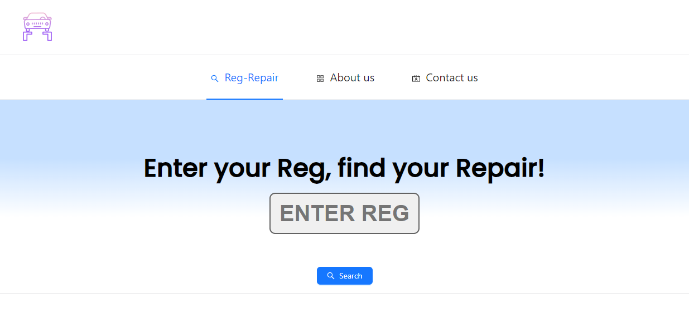
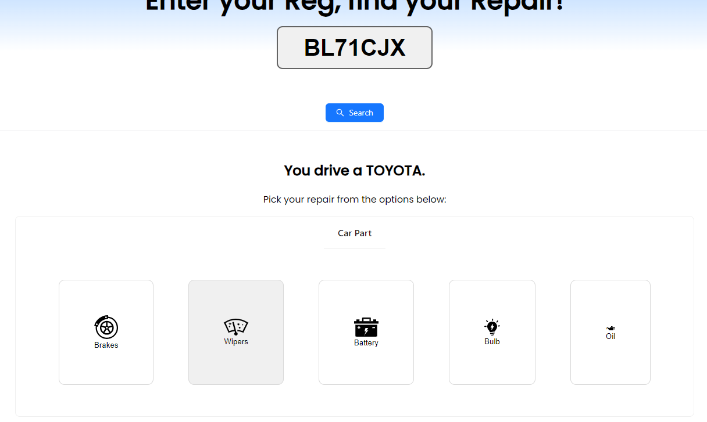
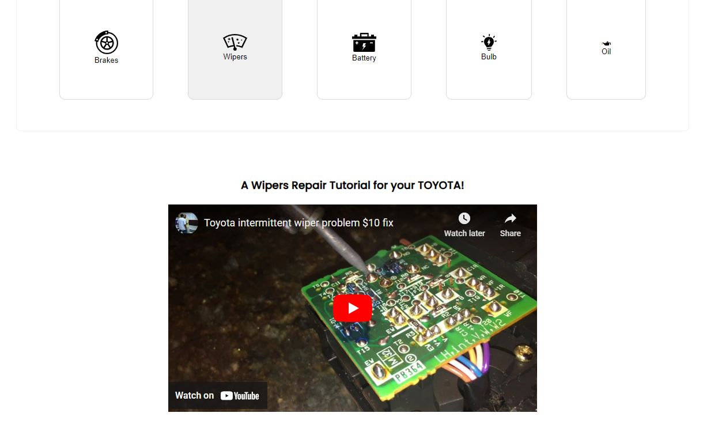

# Reg-Repair Web Application

Welcome to Reg-Repair, your go-to platform for hassle-free car maintenance and repair tutorials.

## Overview

Reg-Repair is an automotive assistance web application designed to provide a seamless experience for all of your car maintenance needs. By simply entering your vehicle's registration plate, you can access tailor-made video tutorials for specific car parts, ensuring you get accurate and relevant repair guidance.

# Table of Contents

1. [Reg-Repair Web Application](#reg-repair-web-application)
   1. [Overview](#overview)
   2. [Features](#features)
   3. [How to use this application?](#how-to-use-this-application)
   4. [Getting Started](#getting-started)
2. [Technology Used](#technology-used)
3. [Deployment](#deployment)
4. [Future Additions](#future-additions)
5. [Images of Application](#images-of-application)
6. [Links of Deployment](#links-of-deployment)

## Features

- **Intuitive Interface:**

Our platform is designed with your convenience in mind, offering a user-friendly and intuitive interface which uses Ant.Design!

- **Personalized Tutorials:**

We use the DVLA API to post a registration number as a paramater which the user puts in and searches via the user interface to return the vehicles make. we then use this as a search query a long with a car part to get tailor-made video tutorials based on your vehicle's make and the specific part you want to repair (brakes, wipers, battery, bulb, or oil).

- **Eliminate Guesswork:**

With this Application we can say goodbye to generic and confusing tutorials. Reg-Repair ensures you receive precise, relevant, and high-quality video content.

## How to use this application?

1. Enter your vehicle's registration plate.
2. Click on the specific part you want to repair (brakes, wipers, battery, bulb, or oil).
3. Enjoy a personalized video tutorial for your car's make.

## Getting Started

To run the Reg-Repair web application locally, follow these steps:

1. Clone the repository:

   ```bash
   git clone https://github.com/balalsaleh/reg-repair
   ```

2. Install Dependencies:

   ```bash
   cd reg-repair
   npm install
   ```

3. Navigate to the project directory and run the following command to install the required npm packages:

   ```bash
   npm install antd@^5.11.0 axios@^1.6.1 react@^18.2.0 react-dom@^18.2.0 react-scripts@5.0.1 react-youtube@^10.1.0
   ```

4. Run the Application
   ```bash
   npm start
   ```

# Technology Used

We used the following NPM packages to build:

##### antd@^5.11.0:

Ant Design is a popular React UI library. It provides a set of high-quality components for building the user interface of your application.

##### axios@^1.6.1

Axios is a promise-based HTTP client for the browser and Node.js. It simplifies making HTTP requests and handling responses in your application.

##### react@^18.2.0:

React is a JavaScript library for building user interfaces. It allows you to create reusable UI components and manage the state of your application efficiently.

##### react-dom@^18.2.0:

ReactDOM is the package responsible for rendering React components into the DOM (Document Object Model).

##### react-scripts@5.0.1:

React Scripts is a set of scripts and configuration used by Create React App to build and run React applications. Version 5.0.1 includes various tools and configurations for development and production builds.

##### react-youtube@^10.1.0:

React YouTube is a React component for embedding YouTube videos. It simplifies the integration of YouTube videos into your React application.

# Deploymenmt

Sadly due to issues with CORS our deployment of the application was unsuccessful, no doubt this is something which can be fixed for the near future. However this deployment would require time, and we were on a time deadline to finish this project.

We tried to use both Netlify and Vercel. These were both unsuccessful.

# Future additions

Simple additions:

- Using a better API get more data
- Storing registrations
- Fixing the CORS issues we encountered

Complex additions:

- Multimedia Content: Enhance user engagement by providing a variety of multimedia content, including video tutorials, interactive 3D models, and augmented reality (AR) guides.

- User Accounts and Profiles: Implement user accounts to allow users to save their vehicle information and preferences, track their repair history, and receive personalised recommendations.

- Community Features: Create a community aspect where users can share their repair experiences, tips, and tricks, fostering a supportive DIY car care community.

- Integration with E-commerce: Enable users to order replacement parts directly through your platform, providing a one-stop solution for repair needs. Or forwarding to industry partners with affiliate marketing.

# Images of Application

So you land onto this landing page, here you can insert your car registration plate.



Once you insert your registration plate. You get your vehicle make and you are given Options for your cars MAKE



You are given a video for your vehicles make based on the option you chose



# Links of deployment:

Netlify: https://reg-repair.netlify.app/

Vercel: https://reg-repair.vercel.app/

Github Repo: https://github.com/balalsaleh/reg-repair
